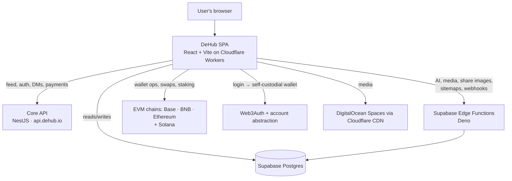

<div align="center">

# DeHub

**The open, user-owned social network for Web3 creators and communities.**

DeHub is a decentralized, wallet-native platform that blends social feeds, long-form
video, shorts, live audio/video, communities, messaging, an on-chain creator economy,
and an in-browser video editor — all in a single React application. It powers
[dehub.io](https://dehub.io).

[](./LICENSE)


</div>

---

## Table of contents

- [Overview](#overview)
- [Features](#features)
- [Tech stack](#tech-stack)
- [Architecture](#architecture)
- [Project structure](#project-structure)
- [Getting started](#getting-started)
- [Environment variables](#environment-variables)
- [Available scripts](#available-scripts)
- [Deployment](#deployment)
- [Contributing](#contributing)
- [License & acknowledgements](#license--acknowledgements)

## Overview

DeHub is a single-page web application that gives creators an identity, an audience, and
a wallet in one place. Authentication is **wallet-native** — users sign in with a social,
email, or SMS login that provisions a self-custodial wallet (via account abstraction), so
there is no traditional username/password account for the core product. Content can be
tokenized, monetized, and rewarded on-chain, while everyday social interactions (feed,
comments, DMs, communities, live rooms) stay fast and familiar.

The web app is the frontend of a larger system: it talks to a core social API, a suite of
serverless functions for AI/compute/payments, and several EVM chains plus Solana.

## Features

**Social & content**
- Unified home feed with Home, Videos, Images, Shorts, Music, and Live tabs
- Long-form video (HLS streaming) and vertical Shorts
- Music feed and player
- Live streaming, plus Stages (live audio spaces with real-time voice and transcription)
- Stories, Communities, Profiles, Notifications, Explore/Search, and Bookmarks
- Direct messages with media, plus voice/video calls

**Web3 & finance**
- Built-in wallet: balances, send/receive, buy, and cross-chain bridging
- Token swaps and staking with reward badges
- Governance proposals and voting
- Leaderboards and market data
- Tokenized posts / watch-to-earn, fractional ownership, and tokenized subscriptions

**Creator & AI**
- In-browser video editor with a timeline, multi-track editing, and export
- AI assistant plus generation tools for images, video, music, and voice
- AI agents and MCP connectors to bring DeHub into ChatGPT and Claude

**Marketplace & commerce**
- Self-serve advertising platform with campaign management
- Affiliate/referral program with attribution
- On-chain freelance work board with escrow and dispute arbitration
- Stores, events, and a premium subscription tier

## Tech stack

| Area | Technologies |
| --- | --- |
| Framework | React 18, Vite 5, TypeScript 5, React Router 6 |
| Styling / UI | Tailwind CSS 3, shadcn/ui on Radix UI, Framer Motion, lucide-react |
| State / data | TanStack Query, Zustand, React Hook Form + Zod |
| Web3 | wagmi, viem, RainbowKit, ethers, Web3Auth, account abstraction (Pimlico/permissionless), MetaMask & Coinbase & WalletConnect SDKs, Solana web3.js |
| Backend SDKs | Supabase JS (data, storage, edge functions) |
| Realtime / media | Socket.IO, Agora RTC, hls.js, mp4-muxer / webm-muxer, Three.js |
| Payments | Stripe |
| i18n / content | i18next, react-markdown, react-helmet-async |
| Tooling | ESLint 9, Vitest, Testing Library |

## Architecture

DeHub's web app is a client to three backends: a core social API, Supabase (serverless
compute + data), and public blockchains.



- **Frontend** — a Vite + React SPA deployed as a Cloudflare Worker with static assets
  (`CLOUDFLARE_WORKER_SEO.js` injects metadata for crawlers and serves the domain-move
  301s for dehub.net and www). The wallet stack is aggressively code-split out of the
  entry bundle and lazy-loaded to keep first paint fast.
- **Core API (`api.dehub.io`)** — the primary social backend (feed, wallet auth, DMs over
  Socket.IO, payments). The SPA prefetches the feed at boot for a fast cold start.
- **Supabase** — Postgres plus a large set of Deno **edge functions** for AI (chat, image,
  video, music, voice, translation, transcription), payments (Stripe), ads, on-chain data
  sync, share-image rendering, sitemaps, and MCP.
- **Identity** — wallet-native via Web3Auth and account abstraction; the core API issues a
  short-lived token stored client-side. Supabase Auth is **not** the user identity system.
- **Chains** — EVM (Base, BNB Chain, Ethereum) and Solana. DHB is DeHub's native token.
- **Media & CDN** — user media is served from DigitalOcean Spaces via Cloudflare CDN.

## Project structure

```
.
├── src/                    # React SPA source
│   ├── components/         # UI — app/ (feeds, video, chat, wallet, editor…), ui/ (shadcn), admin/…
│   ├── pages/              # Route pages (app/, admin/, docs/, marketing)
│   ├── hooks/              # Custom React hooks (feed, auth, staking, on-chain…)
│   ├── lib/                # Non-UI logic: api/, chains/, contracts/, solana/, editor/, wagmi, web3auth
│   ├── contexts/           # React providers (Auth, Theme, Call, Search, Language…)
│   ├── integrations/       # Supabase client + generated types
│   ├── constants/          # Nav/tabs + AI model catalogs and pricing
│   └── i18n/ store/ utils/ types/ …
├── supabase/
│   ├── functions/          # Deno edge functions (AI, payments, ads, sitemaps, MCP…)
│   │   └── _shared/        # Shared helpers (auth, CORS, rate limiting, branding)
│   ├── migrations/         # SQL migrations
│   └── config.toml
├── CLOUDFLARE_WORKER_SEO.js # Edge worker: crawler metadata + alias-host 301s
├── contracts/              # Solidity (freelance work escrow)
├── scripts/                # Build helpers (bundle guard, blog manifest)
├── public/                 # Static assets (_headers = edge cache/security rules)
└── wrangler.jsonc          # Cloudflare Workers config (assets binding, routes)
```

## Getting started

### Prerequisites

- **Node.js 22** and npm
- A wallet browser extension (e.g. MetaMask) for testing wallet flows

### Installation

```sh
git clone https://github.com/DeHubToken/dehubweb.git
cd dehubweb
npm install --legacy-peer-deps
```

> `--legacy-peer-deps` is required — it matches the CI build configuration.

### Running locally

```sh
npm run dev
```

The dev server starts on **http://localhost:8080**. Note that some social data (feed,
profiles) is served by the production core API, which restricts cross-origin requests from
`localhost`; wallet-native and Supabase-backed features work locally.

## Environment variables

Copy `.env.example` to `.env` and fill in the values. All variables are **client-side
(`VITE_*`) publishable keys** — they ship in the browser bundle by design and are safe to
commit. Real secrets live in the Supabase/Cloudflare environment, never in the repo.

| Variable | Purpose |
| --- | --- |
| `VITE_SUPABASE_URL` | Supabase project URL |
| `VITE_SUPABASE_PUBLISHABLE_KEY` | Supabase anon/publishable key (RLS-guarded) |
| `VITE_SUPABASE_PROJECT_ID` | Supabase project ref |
| `VITE_WALLETCONNECT_PROJECT_ID` | WalletConnect project id |
| `VITE_PAYMENTS_CLIENT_TOKEN` | Stripe **test** publishable key (`.env.development` only) |

## Available scripts

| Command | Description |
| --- | --- |
| `npm run dev` | Start the Vite dev server (port 8080) |
| `npm run build` | Production build to `dist/` (runs the entry-bundle guard) |
| `npm run build:dev` | Development-mode build |
| `npm run preview` | Preview the production build locally |
| `npm run lint` | Run ESLint |

## Deployment

The app builds with `npm run build` and deploys `dist/` as Cloudflare Worker static
assets (see `wrangler.jsonc`; Workers Builds deploys on push to main). The worker handles
the SPA fallback, crawler metadata, and alias-host 301s; `public/_headers` carries cache
and security headers. Supabase edge functions and database migrations live under
`supabase/` and are deployed to the Supabase project separately from the frontend.

## Contributing

Contributions are welcome. Please open an issue to discuss substantial changes before
sending a pull request, keep changes focused, and run `npm run lint` before submitting.

## License & acknowledgements

Released under the [MIT License](./LICENSE).

The in-browser video editor is adapted from the open-source
[OpenCut](https://github.com/OpenCut-app/OpenCut) project; see
[`LICENSE-OpenCut`](./LICENSE-OpenCut) for its notice.
