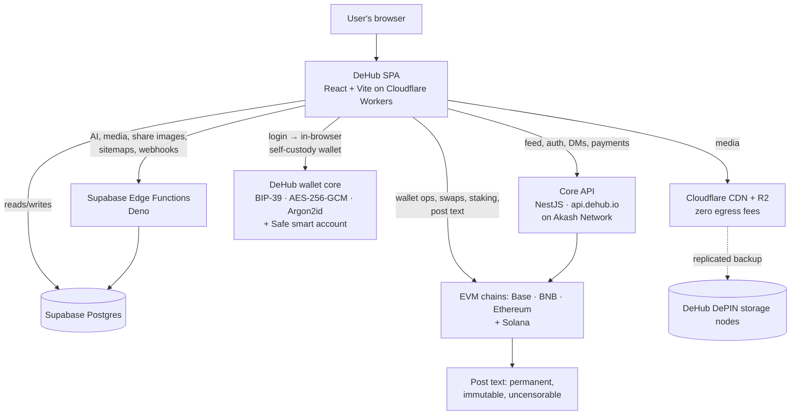

<div align="center">

# DeHub

**The open, user-owned social network for Web3 creators and communities.**

DeHub is a decentralized, wallet-native platform that blends social feeds, long-form
video, shorts, live audio/video, communities, messaging, an on-chain creator economy,
and an in-browser video editor — all in a single React application. It powers
[dehub.io](https://dehub.io).

[](./LICENSE)


</div>

---

## Table of contents

- [Overview](#overview)
- [Features](#features)
- [Tech stack](#tech-stack)
- [Architecture](#architecture)
- [Project structure](#project-structure)
- [Getting started](#getting-started)
- [Environment variables](#environment-variables)
- [Available scripts](#available-scripts)
- [Deployment](#deployment)
- [Contributing](#contributing)
- [License & acknowledgements](#license--acknowledgements)

## Overview

DeHub is a single-page web application that gives creators an identity, an audience, and
a wallet in one place. Authentication is **wallet-native** — users sign in with a social,
email, or SMS login and DeHub provisions a **self-custodial wallet in the browser**: a
BIP-39 seed generated on the device, encrypted client-side with AES-256-GCM behind an
Argon2id-derived key, and paired with a Safe smart account. No third-party key custodian
is involved, and no plaintext key ever reaches a DeHub server. Content can be tokenized,
monetized, and rewarded on-chain, while everyday social interactions (feed, comments, DMs,
communities, live rooms) stay fast and familiar.

The web app is the frontend of a larger system: it talks to a core social API running on
decentralized compute, a suite of serverless functions for AI/compute/payments, and
several EVM chains plus Solana. **Post text lives on-chain** — permanently, immutably, and
beyond the reach of any single host or takedown request.

## Features

**Social & content**
- Unified home feed with Home, Videos, Images, Shorts, Music, and Live tabs
- Long-form video (HLS streaming) and vertical Shorts
- Music feed and player
- Live streaming, plus Stages: live audio rooms with a host soundboard, screen share,
  recordings, real-time subtitles translated per listener, and live dubbing in the host's
  own cloned voice
- Stories, Communities, Profiles, Notifications, Explore/Search, and Bookmarks
- Direct messages with media and files, smart reply suggestions, plus voice/video calls
- Nine reactions weighted by the reactor's staking badge, threaded comments, and creator-set
  mature-content ratings that keep marked posts off public discovery
- Automatic translation of posts, comments and live stage captions into 100+ languages
- Ten appearance themes, two of which hide a playable game

**Web3 & finance**
- Built-in wallet: balances, send/receive, buy, and cross-chain bridging
- Token swaps and staking with reward badges, priced in dollars against the live DHB price
  and lendable to other accounts one delegation slot per tier climbed
- A daily posting allowance that scales with your badge, with DHB charged pro-rata on overage
- Governance proposals and voting
- Leaderboards and market data
- Tokenized posts / watch-to-earn, fractional ownership, and tokenized subscriptions —
  minting is optional, so a post can publish off-chain and be minted later

**Creator & AI**
- In-browser video editor with a timeline, multi-track editing, and export
- AI assistant plus generation tools for images, video, music, and voice
- AI agents, a no-code app Builder, and MCP connectors to bring DeHub into ChatGPT and Claude
- An arcade of five browser games shipped in this repo — King's Gambit, Claude of Duty,
  Jungle Trail, Street Slayer and Trenchstar (which also runs in a WebXR headset)

**Marketplace & commerce**
- Self-serve advertising platform with campaign management
- Affiliate/referral program with attribution
- Bounty Hunting: a native task board with escrow and dispute arbitration, paid in DHB or USDC
- Stores, events, and a premium subscription tier

## Tech stack

| Area | Technologies |
| --- | --- |
| Framework | React 18, Vite 5, TypeScript 5, React Router 6 |
| Styling / UI | Tailwind CSS 3, shadcn/ui on Radix UI, Framer Motion, lucide-react |
| State / data | TanStack Query, Zustand, React Hook Form + Zod |
| Web3 | wagmi, viem, RainbowKit, ethers, in-house self-custody wallet (BIP-39 + AES-256-GCM/Argon2id), account abstraction (Safe via Pimlico/permissionless), MetaMask & Coinbase & WalletConnect SDKs, Solana web3.js |
| Backend SDKs | Supabase JS (data, storage, edge functions) |
| Realtime / media | Socket.IO, Agora RTC, hls.js, mp4-muxer / webm-muxer, Three.js |
| Payments | Stripe |
| i18n / content | i18next, react-markdown, react-helmet-async |
| Tooling | ESLint 9, Vitest, Testing Library |
| Infrastructure | Cloudflare Workers (SPA edge), Cloudflare R2 + CDN (media, zero egress), Akash Network (decentralized compute for the core API), DeHub DePIN nodes (storage/transcode/delivery) |

## Architecture

DeHub's web app is a client to three backends: a core social API on decentralized compute,
Supabase (serverless compute + data), and public blockchains. Nothing in the stack depends
on a centralized cloud provider for the parts that matter — compute runs on Akash, media
has a DePIN copy behind the CDN, and post text is written to chain.


```mermaid
flowchart TD
    U[User's browser] --> SPA[DeHub SPA<br/>React + Vite on Cloudflare Workers]
    SPA -->|feed, auth, DMs, payments| API[Core API<br/>NestJS · api.dehub.io<br/>on Akash Network]
    SPA -->|AI, media, share images,<br/>sitemaps, webhooks| EF[Supabase Edge Functions<br/>Deno]
    SPA -->|reads/writes| DB[(Supabase Postgres)]
    SPA -->|wallet ops, swaps, staking,<br/>post text| CHAIN[EVM chains: Base · BNB · Ethereum<br/>+ Solana]
    SPA -->|login → in-browser<br/>self-custody wallet| WALLET[DeHub wallet core<br/>BIP-39 · AES-256-GCM · Argon2id<br/>+ Safe smart account]
    EF --> DB
    API --> CHAIN
    SPA -->|media| CDN[Cloudflare CDN + R2<br/>zero egress fees]
    CDN -.->|replicated backup| DEPIN[(DeHub DePIN storage nodes)]
    CHAIN --> TEXT[Post text: permanent,<br/>immutable, uncensorable]
```

- **Frontend** — a Vite + React SPA deployed as a Cloudflare Worker with static assets
  (`CLOUDFLARE_WORKER_SEO.js` injects metadata for crawlers and serves the domain-move
  301s for dehub.net and www). The wallet stack is aggressively code-split out of the
  entry bundle and lazy-loaded to keep first paint fast.
- **Core API (`api.dehub.io`)** — the primary social backend (feed, wallet auth, DMs over
  Socket.IO, payments), deployed to **Akash Network** decentralized compute (it previously
  ran on DigitalOcean droplets). The SPA prefetches the feed at boot for a fast cold start.
- **Supabase** — Postgres plus a large set of Deno **edge functions** for AI (chat, image,
  video, music, voice, translation, transcription), payments (Stripe), ads, on-chain data
  sync, share-image rendering, sitemaps, and MCP.
- **Identity & keys** — DeHub runs its **own** wallet/encryption stack (`src/lib/wallet-core`,
  `src/lib/smart-wallet`); **Web3Auth is no longer part of the login path**. Login identity
  comes from Supabase Auth (email OTP / social OAuth), and the wallet itself is derived from
  a BIP-39 seed generated on-device, sealed with AES-256-GCM under an Argon2id key
  (64 MiB, t=3 — well above the OWASP baseline, and stronger than the PBKDF2 wallets it
  replaced), and only ever stored as ciphertext. Decrypted key material lives in JS memory
  only — never in localStorage or sessionStorage. The derived EOA drives a Safe smart
  account, and the core API issues a short-lived session token. The legacy Web3Auth SDK is
  retained solely for a one-time key export so pre-migration users can import the same key
  and keep the same address (`src/lib/legacy-web3auth.ts`).
- **Chains** — EVM (Base, BNB Chain, Ethereum) and Solana. DHB is DeHub's native token.
- **Text content is on-chain** — post bodies, comments and other text are written to chain
  as part of the tokenized post, so they are **permanent, immutable and impossible to
  censor**: no DeHub server, host, or CDN can edit or remove them, and the content survives
  even if every DeHub-operated service disappears. Off-chain databases hold only indexes
  and caches of that canonical on-chain text.
- **Media, CDN & storage** — user media is served through **Cloudflare CDN backed by
  Cloudflare R2**, chosen because R2 has **no egress fees** (video-heavy traffic on
  per-GB-egress object storage was the single largest infra cost). Every object is also
  **replicated to DeHub's DePIN storage nodes** as an independent backup, so the platform
  keeps a decentralized copy of all media rather than trusting one provider. Some older
  asset URLs still resolve through the previous object-storage host while the back catalog
  finishes migrating.

## Project structure

```
.
├── src/                    # React SPA source
│   ├── components/         # UI — app/ (feeds, video, chat, wallet, editor…), ui/ (shadcn), admin/…
│   ├── pages/              # Route pages (app/, admin/, docs/, marketing)
│   ├── hooks/              # Custom React hooks (feed, auth, staking, on-chain…)
│   ├── lib/                # Non-UI logic: api/, chains/, contracts/, solana/, editor/, wagmi,
│   │                       #   wallet-core/ (seed derivation + AES-256-GCM/Argon2id), smart-wallet
│   ├── contexts/           # React providers (Auth, Theme, Call, Search, Language…)
│   ├── integrations/       # Supabase client + generated types
│   ├── constants/          # Nav/tabs + AI model catalogs and pricing
│   └── i18n/ store/ utils/ types/ …
├── supabase/
│   ├── functions/          # Deno edge functions (AI, payments, ads, sitemaps, MCP…)
│   │   └── _shared/        # Shared helpers (auth, CORS, rate limiting, branding)
│   ├── migrations/         # SQL migrations
│   └── config.toml
├── CLOUDFLARE_WORKER_SEO.js # Edge worker: crawler metadata + alias-host 301s
├── contracts/              # Solidity (freelance work escrow)
├── scripts/                # Build helpers (bundle guard, blog manifest)
├── public/                 # Static assets (_headers = edge cache/security rules)
└── wrangler.jsonc          # Cloudflare Workers config (assets binding, routes)
```

## Getting started

### Prerequisites

- **Node.js 22** and npm
- A wallet browser extension (e.g. MetaMask) for testing wallet flows

### Installation

```sh
git clone https://github.com/DeHubToken/dehubweb.git
cd dehubweb
npm install --legacy-peer-deps
```

> `--legacy-peer-deps` is required — it matches the CI build configuration.

### Running locally

```sh
npm run dev
```

The dev server starts on **http://localhost:8080**. Note that some social data (feed,
profiles) is served by the production core API, which restricts cross-origin requests from
`localhost`; wallet-native and Supabase-backed features work locally.

## Environment variables

Copy `.env.example` to `.env` and fill in the values. All variables are **client-side
(`VITE_*`) publishable keys** — they ship in the browser bundle by design and are safe to
commit. Real secrets live in the Supabase/Cloudflare environment, never in the repo.

| Variable | Purpose |
| --- | --- |
| `VITE_SUPABASE_URL` | Supabase project URL |
| `VITE_SUPABASE_PUBLISHABLE_KEY` | Supabase anon/publishable key (RLS-guarded) |
| `VITE_SUPABASE_PROJECT_ID` | Supabase project ref |
| `VITE_WALLETCONNECT_PROJECT_ID` | WalletConnect project id |
| `VITE_PAYMENTS_CLIENT_TOKEN` | Stripe **test** publishable key (`.env.development` only) |

## Available scripts

| Command | Description |
| --- | --- |
| `npm run dev` | Start the Vite dev server (port 8080) |
| `npm run build` | Production build to `dist/` (runs the entry-bundle guard) |
| `npm run build:dev` | Development-mode build |
| `npm run preview` | Preview the production build locally |
| `npm run lint` | Run ESLint |

## Deployment

The app builds with `npm run build` and deploys `dist/` as Cloudflare Worker static
assets (see `wrangler.jsonc`; Workers Builds deploys on push to main). The worker handles
the SPA fallback, crawler metadata, alias-host 301s, and the `/api/stats` endpoint behind
the live-stats page; `public/_headers` carries cache and security headers. Supabase edge
functions and database migrations live under `supabase/` and are deployed to the Supabase
project separately from the frontend.

### Worker secret — live stats

`/stats` reads real visitor numbers from Cloudflare's GraphQL Analytics API, which needs
one API token on the worker:

```
wrangler secret put CF_ANALYTICS_TOKEN
```

Create the token in the Cloudflare dashboard with **Zone → Analytics → Read** on
`dehub.io` (nothing else — it is only ever used for read-only aggregate queries). The
zone tag is not a secret and is compiled in; override it with a `CF_ZONE_TAG` var if the
zone ever changes. Until the token is set, `/api/stats` answers `501 {"ok":false,
"reason":"unconfigured"}` and the page says so rather than displaying invented numbers.

The rest of the platform deploys outside this repo: the core API ships as a container to
**Akash Network**, media lands in **Cloudflare R2** (fronted by the CDN, replicated to the
DePIN storage nodes), and post text is committed on-chain by the tokenized-post contracts.

## Contributing

Contributions are welcome. Please open an issue to discuss substantial changes before
sending a pull request, keep changes focused, and run `npm run lint` before submitting.

## License & acknowledgements

Released under the [MIT License](./LICENSE).

The in-browser video editor is adapted from the open-source
[OpenCut](https://github.com/OpenCut-app/OpenCut) project; see
[`LICENSE-OpenCut`](./LICENSE-OpenCut) for its notice.
